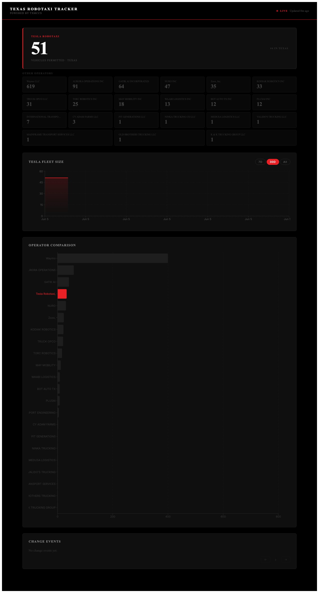

# Texas Robotaxi Tracker

Texas 주 교통부(TxMCCS)에 등록된 자율주행차 운영사의 허가 차량 수를 추적하는 대시보드입니다. Tesla Robotaxi를 중심으로 Waymo, Aurora 등 경쟁사 현황을 함께 모니터링합니다.



## 구성

```
├── scraper/     # TxMCCS 공개 API 폴링 (15분 간격)
├── api/         # FastAPI REST API
├── frontend/    # React + Recharts 대시보드 (HTTPS / Nginx)
├── docs/        # 설계 스펙·구현 플랜
└── docker-compose.yml
```

| 서비스 | 포트 | 설명 |
|--------|------|------|
| frontend | **8443** (HTTPS) | 대시보드 UI |
| api | 8000 | REST API |
| scraper | — | 백그라운드 수집기 |

세 서비스가 공유 Docker volume(`robotaxi_db`)의 SQLite DB(`/data/robotaxi.db`)를 사용합니다.

## 실행

```bash
./run_docker.sh
# 또는
docker compose up --build -d
```

- 대시보드: https://localhost:8443  
  (로컬 인증서: `certs/` — `frontend/nginx.conf`의 경로와 맞춰야 함)
- API 직접 접근: http://localhost:8000
- 프론트는 `/api/*`를 api 컨테이너로 프록시합니다.

스크래퍼는 시작 시 즉시 한 번 수집하고, 이후 **15분마다** TxMCCS를 폴링합니다.

### 선택: Web Push 알림

Tesla 차량 수 변경 시 브라우저 푸시를 보내려면:

1. `python3 scripts/gen_vapid_keys.py` 로 VAPID 키 생성
2. `.env`에 `VAPID_PUBLIC_KEY`, `VAPID_CLAIM_EMAIL` 설정 (`vapid/private_key.pem` 마운트)
3. 대시보드에서 **알림 받기** 클릭 (HTTPS + Service Worker 필요)

## API

| Method | Path | 설명 |
|--------|------|------|
| GET | `/snapshots/latest` | 운영사별 최신 차량 수·구성 |
| GET | `/operators` | 전체 운영사 + 최신 스냅샷 |
| GET | `/operators/{id}/history` | 시계열 (`?days=7\|30`, 생략 시 전체) |
| GET | `/events/changes` | 차량 수 변경 이벤트 (`?page=1`) |
| GET | `/health` | 스크래퍼 상태 (아래 참고) |
| GET | `/push/vapid-public-key` | Web Push 공개 키 |
| POST | `/push/subscribe` | 푸시 구독 등록 |
| DELETE | `/push/unsubscribe` | 푸시 구독 해제 |

### `GET /health` 응답

```json
{
  "status": "ok",
  "last_scrape_at": "2026-08-08T00:33:02.962399+00:00",
  "last_attempt_at": "2026-08-08T00:33:02.962399+00:00",
  "last_success_at": "2026-08-08T00:33:02.962399+00:00",
  "last_error": null,
  "operators_ok": 14,
  "operators_failed": 0,
  "data_age_seconds": 120,
  "stale": false
}
```

| `status` | 의미 |
|----------|------|
| `ok` | 최근 수집 성공, 데이터 신선 (45분 이내) |
| `degraded` | 일부 운영사만 실패 |
| `stale` | 마지막 성공이 45분 초과 |
| `failed` | 이번 시도에서 운영사 0건 저장 |
| `no_data` | 스냅샷/성공 기록 없음 |

프론트엔드는 `status !== "ok"`일 때 상단 경고 배너와 헤더 상태(Live / Degraded / Stale / Offline)를 표시합니다.

## 데이터 출처 (TxMCCS)

[Texas Motor Carrier Credentialing System](https://www.txmccs.com/) — 공개 REST API, 읽기 인증 불필요.

**Base:** `https://txmccs.txdmv.gov/api/TruckStop`

| 용도 | Endpoint |
|------|----------|
| 검색 | `GET /companies?searchType=company_name\|autonomous_vehicle_authorization_number&searchValue=...` |
| 회사 상세 | `GET /companies/{businessEntityId}` |
| 자율주행 차량 목록 | `GET /companies/{businessEntityId}/automated-motor-vehicles` |

> **2026-07-30 변경:** 예전 경로  
> `/operators/{authorizationNumber}` · `/operators/{id}/vehicles` 는 SPA HTML만 반환합니다.  
> 상세 필드 매핑은 [`scraper/selector_findings.txt`](scraper/selector_findings.txt) 참고.

운영사 발견 방식:

1. 알려진 운영사를 `company_name`으로 조회 (Tesla Robotaxi, Waymo, Zoox 등)하고, 검색 실패 시 하드코딩된 `businessEntityId`로 폴백
2. 특정 운영사 이름 키워드로 추가 발견 (`Robotics`/`Mobility`/`AI`는 보조)
3. `businessEntityId`로 상세·차량 목록 수집 후 SQLite 스냅샷 저장

> **2026-09-01:** `autonomous_vehicle_authorization_number` 검색이 모든 알려진 AV 번호에 대해 `total=0`을 반환합니다. company_name / BE id가 현재 경로입니다.

## 데이터 모델 (요약)

- **operators** — 허가번호(`id`)·이름
- **snapshots** — 운영사별 차량 수, dominant model, `vehicle_composition` JSON, 상태, raw JSON
- **scrape_health** — 싱글톤 행: 마지막 시도/성공, 성공·실패 건수, 오류 메시지, status
- **push_subscriptions** — Web Push 엔드포인트

## 개발·테스트

```bash
# scraper
docker run --rm robotaxi-tracker-scraper sh -c "pip install -q pytest && pytest -q"

# api (scraper db 모듈 경로 필요)
docker run --rm \
  -v "$PWD/api:/app" -v "$PWD/scraper:/scraper" -w /app \
  robotaxi-tracker-api \
  sh -c "pip install -q pytest httpx && PYTHONPATH=/scraper pytest test_api.py -q"
```

## 문서

| 문서 | 내용 |
|------|------|
| [docs/superpowers/specs/](docs/superpowers/) | 설계 스펙 (원본 + 개정 노트) |
| [scraper/selector_findings.txt](scraper/selector_findings.txt) | TxMCCS API 필드·엔드포인트 조사 결과 |
| [docs/DATA_SOURCE.md](docs/DATA_SOURCE.md) | 데이터 소스·헬스·UI 경고 상세 |
